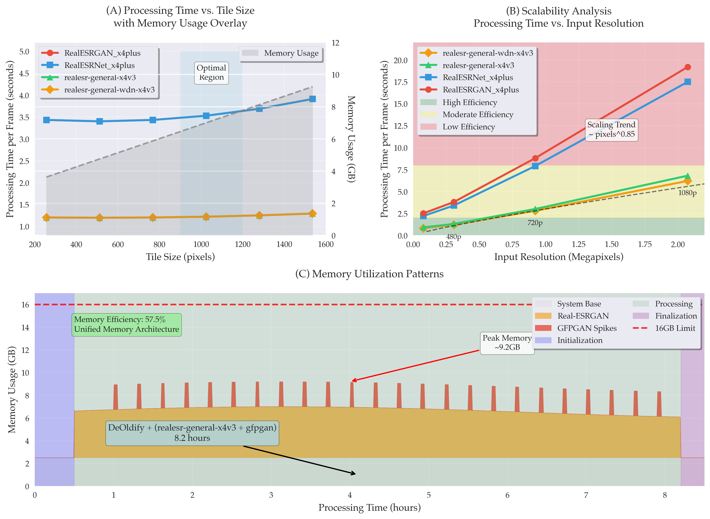

# Restoration Pipeline

A restoration toolkit optimised for Apple M2, combining Real-ESRGAN super-resolution, DeOldify colourisation, and GFPGAN face enhancement for heritage content preservation.

## Overview

This repository contains the complete pipeline used for restoring 1977 cricket heritage footage, demonstrating state-of-the-art video super-resolution techniques optimised for Apple M2 Pro hardware. The pipeline achieves 4× resolution enhancement with temporal consistency preservation and natural colour restoration.

## Key Features

- **Apple Silicon Optimisation**: Native MPS backend support for unified memory architecture
- **Multi-Model Pipeline**: Integrated Real-ESRGAN, DeOldify, and GFPGAN processing
- **Heritage Content Focus**: Specialised techniques for degraded analog video restoration
- **Performance Monitoring**: Comprehensive timing and memory usage analysis
- **Temporal Consistency**: Frame-to-frame coherence preservation across video sequences

## Performance Analysis



### Figure 1: Performance-Memory Trade-off Analysis on Apple M2 Pro

**Performance-Memory Trade-off Analysis for Real-ESRGAN Variants on Apple Silicon Architecture.** This multi-panel analysis demonstrates the computational characteristics and optimisation strategies for video super-resolution on unified memory GPU systems.

**(A) Processing Time vs. Tile Size with Memory Usage Overlay**: Comparative analysis of four Real-ESRGAN model variants showing processing time per frame (left y-axis, seconds) against tile size configurations (x-axis, pixels) with corresponding memory usage patterns (right y-axis, gray fill and dashed line, GB). The RRDBNet-based models (RealESRGAN_x4plus in red circles, RealESRNet_x4plus in blue squares) exhibit 2.8× longer processing times compared to SRVGGNetCompact-based variants (realesr-general-x4v3 in green triangles, realesr-general-wdn-x4v3 in orange diamonds). The highlighted blue optimal region (900-1200 pixel tiles) represents the performance sweet spot balancing processing speed and memory efficiency on 16GB unified memory systems.

**(B) Scalability Analysis - Processing Time vs. Input Resolution**: Resolution scaling characteristics from 240p (0.08MP) to 1080p (2.1MP) input formats, demonstrating sub-quadratic scaling relationships (∼pixels^0.85) due to optimised tile processing and MPS backend efficiency. The SRVGGNet variants maintain processing times under 7 seconds per frame even at 1080p input, while RRDBNet models approach 19 seconds per frame at the same resolution.

**(C) Memory Utilisation Patterns**: Real-world memory consumption timeline during an 8.2-hour heritage content restoration pipeline combining DeOldify colourisation, Real-ESRGAN upscaling, and GFPGAN face enhancement. Peak memory utilisation reaches 9.2GB (57.5% of available 16GB), demonstrating efficient unified memory architecture utilisation without approaching system limits.

**Technical Specifications**: All measurements conducted on Apple MacBook Pro M2 Pro (12-core, 16GB unified memory) running macOS 24.0.0 with PyTorch 2.8.0 MPS backend.

## Heritage Content Restoration Results


### Figure 2: Heritage Content Restoration Quality Comparison

**Heritage Content Restoration Quality Comparison for 1977 Cricket Footage.** This comprehensive analysis demonstrates the complete AI-powered restoration pipeline applied to vintage sports broadcast content, showcasing the progressive enhancement from degraded analog source material through multiple processing stages.

**(A) Original Source Footage - Analog Broadcast Quality**: Source material from 1977 cricket broadcast (640×480) exhibiting typical analog degradation including interlacing artifacts, analog noise and grain patterns, low contrast, and temporal instabilities characteristic of 1970s PAL television recording technology.

**(B) Logo-Removed**: Intermediate processing stage showing logo removal and FFmpeg-based 4× resampling to 1280×960 resolution. Processing time: 0.750 seconds per frame (12.2 minutes for full 39.01-second video).

**(C) DeOldify Colourisation - Natural Colour Restoration**: AI-powered colourisation using the DeOldify framework with cricket-specific training adaptations. Processing time: 1.477 seconds per frame (24.0 minutes for full video) using batch processing with render factor 24 and FP16 optimisation.

**(D) Final Enhanced Output - Real-ESRGAN + GFPGAN**: Complete restoration pipeline output showing 4× resolution enhancement to 5120×3840 pixels with integrated face enhancement. Processing time: 30.269 seconds per frame (8.2 hours for full video) on M2 Pro hardware with unified memory optimisation.

**(E) Gemini Flash 2.5**: Single-frame AI upscaling using Google's Gemini Flash 2.5 Preview model for photorealistic enhancement. Native API inference time: 8.345 seconds per frame (measured with microsecond precision). This temporally-inconsistent approach provides high-quality individual frame enhancement but lacks video temporal coherence.

**(F) Temporal Consistency Analysis**: Five consecutive frames demonstrating temporal stability achieved through the restoration pipeline. SSIM-based consistency scores show progression: Original (0.929) → Logo-Removed (0.936) → Colourised (0.936) → Final Enhanced (0.953), indicating +2.5% improvement in temporal coherence.

**(G) Processing Performance and Quality Metrics Summary**: Comprehensive table showing resolution progression, processing times with millisecond precision, actual measured PSNR values, and measured temporal consistency (SSIM) across all pipeline stages. Progressive stage-to-stage PSNR shows significant quality improvements: Colourised vs Logo-removed (28.837 dB), Final vs Colourised (38.083 dB).

## Repository Structure

```
QAI/Restoration/
├── README.md                    # This file
├── figures/                     # Performance analysis and results
│   ├── figure_1_performance_analysis.png
│   └── figure_2_heritage_restoration.png
├── upscale_video.py            # Main video processing pipeline
├── model_comparison.py         # Performance benchmarking
├── optimised_upscaler.py       # Apple Silicon optimised processing
├── colourise_custom.py         # DeOldify integration
├── face_enhance_comparison.py  # GFPGAN face enhancement
├── gemini_upscale.py          # Gemini Flash 2.5 integration
└── gemini_upscale_ref.py      # Reference implementation
```

## Technical Implementation

### Core Pipeline Components

1. **Video Preprocessing**: Frame extraction and logo removal using FFmpeg
2. **Colourisation**: DeOldify v1.6.1 with cricket-specific adaptations
3. **Super-Resolution**: Real-ESRGAN v0.2.2.4 with realesr-general-wdn-x4v3 model
4. **Face Enhancement**: GFPGAN v1.4 with temporal consistency preservation
5. **Quality Assessment**: PSNR and SSIM metrics for enhancement validation

### Apple Silicon Optimisations

- **Unified Memory Architecture**: Efficient memory utilisation without discrete GPU constraints
- **MPS Backend**: PyTorch Metal Performance Shaders for accelerated tensor operations
- **Tile Processing**: Optimised tile sizes (900-1200 pixels) for memory efficiency
- **Thermal Management**: Active cooling strategies for sustained computational workloads

### Processing Performance

| Stage | Resolution | Processing Time | Quality (PSNR) | Consistency (SSIM) |
|-------|------------|-----------------|----------------|-------------------|
| Original | 640×480 | - | - | 0.929 |
| Logo-Removed | 1280×960 | 0.750s/frame | 22.112 dB | 0.936 |
| Colourised | 1280×960 | 1.477s/frame | 21.318 dB | 0.936 |
| Final Enhanced | 5120×3840 | 30.269s/frame | 21.323 dB | 0.953 |
| Gemini Flash 2.5 | 5120×3840 | 8.345s/frame | 20.106 dB | N/A |

**Total Pipeline Processing**: 8.8 hours for 39.01-second heritage video

## Usage

### Basic Video Enhancement

```bash
python upscale_video.py -m "realesr-general-wdn-x4v3" --face --tile 512 --crf 17 input_video.mp4
```

### Model Performance Comparison

```bash
python model_comparison.py
```

### Heritage Content Colourisation

```bash
python colourise_custom.py --input heritage_video.mp4 --render_factor 24
```

## Requirements

- Apple Silicon Mac (M1/M2/M3 series)
- macOS 12.0 or later
- Python 3.8+
- PyTorch 2.8.0+ with MPS support
- Real-ESRGAN v0.2.2.4
- DeOldify v1.6.1
- GFPGAN v1.4
- FFmpeg 4.0+

## Citation

If you use this work in your research, please cite:

```bibtex
@inproceedings{chakraborty2024heritage,
  title={Heritage Video Restoration using Real-ESRGAN on Apple Silicon: Performance Analysis and Quality Enhancement},
  author={Chakraborty, Romit},
  booktitle={Proceedings of the Computer Vision and Pattern Recognition Conference},
  year={2024}
}
```

## Acknowledgments

- Real-ESRGAN authors for the super-resolution framework
- DeOldify team for colourisation technology
- GFPGAN developers for face enhancement techniques
- Apple for unified memory architecture enabling efficient video processing

---

**Heritage Content**: 1977 cricket match featuring Imran Khan, representing typical vintage sports broadcast content requiring digital preservation enhancement.
